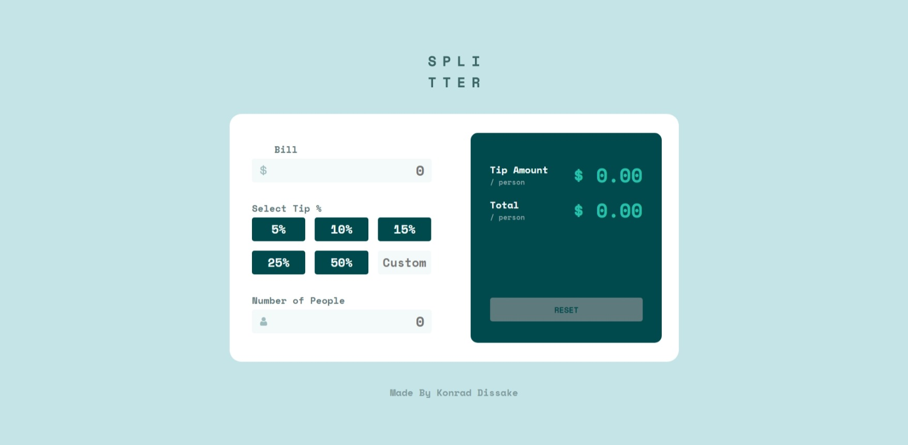
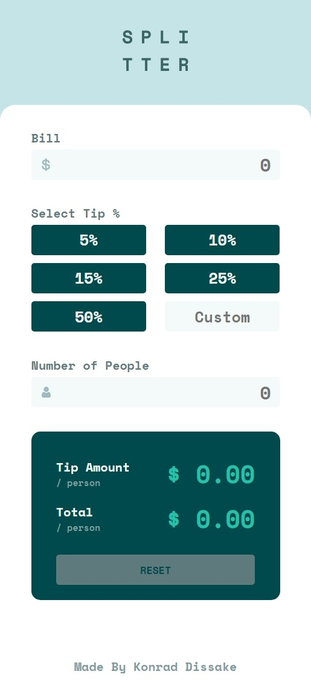

# Tip-calculator-app

This is a solution to the [Tip calculator app challenge on Frontend Mentor](https://www.frontendmentor.io/challenges/tip-calculator-app-ugJNGbJUX).

## Overview

### The challenge

Users should be able to:

- View the optimal layout for the app depending on their device's screen size
- See hover states for all interactive elements on the page
- Calculate the correct tip and total cost of the bill per person

### Screenshot

### Links

- Solution URL: (https://github.com/konraddissake1808/Tip-calculator-app)
- Live Site URL: (https://konraddissake1808.github.io/Tip-calculator-app/)

### Built with

- Semantic HTML5 markup
- CSS custom properties
- Flexbox
- CSS Grid
- Mobile-first workflow

## Author

- Frontend Mentor - [@konraddissake1808](https://www.frontendmentor.io/profile/konraddissake1808)
- LinkedIn - [@Konrad Dissake Ngando](https://www.linkedin.com/in/konrad-dissake-ngando)